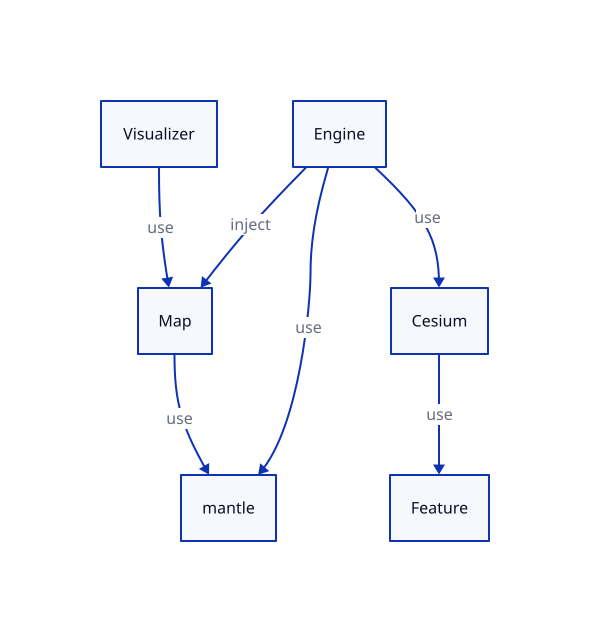

# @reearth/core

- **Visualizer**: Map
- **Map**: Engine + mantle

## Context

We have some type of the context to expose the interface for the map API. The map API is the abstracted map engine API. For example, we are using Cesium as the map engine, but we have a plan to support another map engine in the future. To do this, we define the interface as the map API. The map API is abstracted as MapRef internally. The MapRef has two type of API for now. First one is EngineRef that is API to access to the map engine's API. And second one is LayersRef that is API to access to the abstracted layer system. This manages the data to display for the map engine.

We have the context as the follows.

- FeatureContext ... It works as the interface for exposing the map API to the Feature components and the Layers component.
- WidgetContext ... It works as the interface for exposing the map API to the Widget components.
- VisualizerContext ... It works as the interface for exposing the map API to Visualizer.

By defining these context as the interface, we can understand which API for the map API is used in each layer. And if there are some features of the map API depends on the layer, we can absorb the feature in the context.

## Devlopment

You have several way to develop this library.
1. You can use storybook: `yarn storybook`
2. You can use example project: `yarn dev`
3. You can also use different project with this library: `yarn build && yarn link`, then `cd ../other-project && yarn link @reearth/core`

## License
